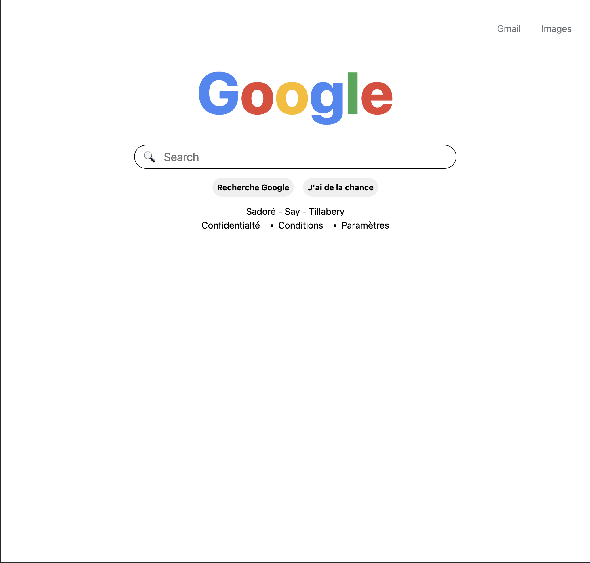
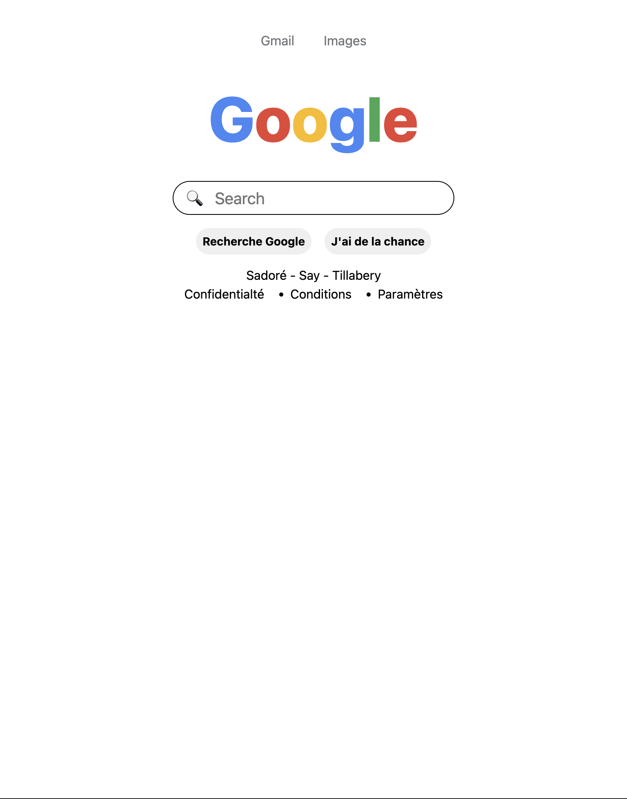
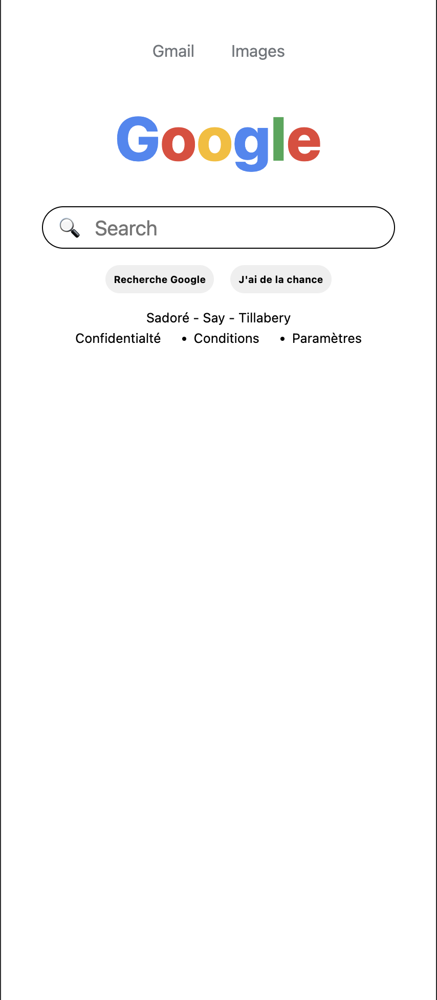
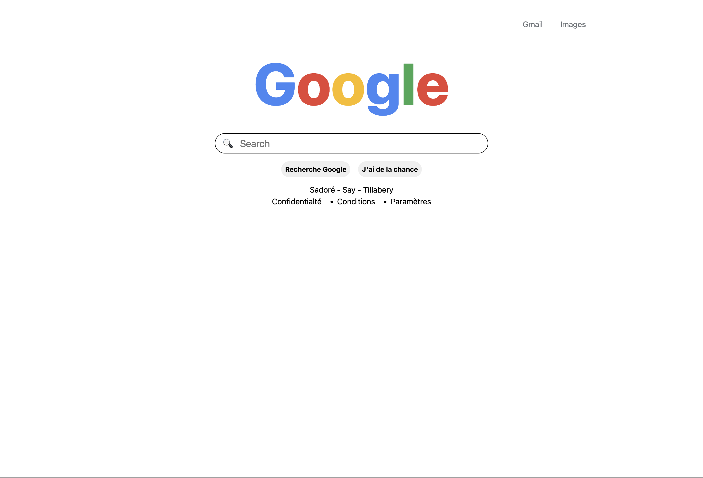

# Projet Google Home Page

## Spécifications
Ce projet consiste à recréer la page d’accueil de Google en utilisant uniquement les technologies HTML et CSS. L’objectif est de s’exercer à la structuration d’une page web, à l’utilisation des balises sémantiques, à la mise en forme avec CSS et à la reproduction fidèle d’une interface célèbre.

* Structuration de la page avec les balises header, main et footer.
* Affichage du logo Google stylisé avec du texte.
* Création d’une barre de recherche accessible et de boutons d’action.
* Ajout d’un pied de page avec des informations fictives.
* Respect des bonnes pratiques d’accessibilité et de responsive design.

Ce projet permet de consolider les bases du développement web tout en développant le sens du détail et de la précision dans la reproduction d’interfaces.

## Structure HTML
Tout d'abord dans le head, j'ai défini le lien de vers le style css qui sera appliqué à la structure HTML. Puis, j'ai divosé le body en header, main, footer. 
* A l'intérieur du header, j'ai utilisé nav, qui contient en elle ul li et a pour les liens Gmail et Images.
* A l'intérieur du main, le contenu principal. il est divisé en deux sections, top-section et research-section. top section qui contient le logo google et research-section qui contient un formulaire de recherche et deux boutons.
* A l'intérieur du footer, un p pour l'adressage et une nav qui contient les confidentialités paramètres et conditions.

## Structure CSS
A ce niveau, j'ai séctionné la palette de couleur qui nous avait été donnée, pour les stocker dans des variables avec :root, afin de pouvoir mieux les situés. Pour mieux stylisé les différents container, j'ai privilégier l'utilisation des classes pour ceux qui se répètent afin de les faire hérité d'un design similaire aux container concernés, l'utilisation des flexbox et de ces différents caractéristiques. Au niveau de la responsivité, le design change à partir de la largeur d'écran 768px, ensuite à 425px comme l'illustre les images qui suivent: 

### 1024px
 

### 768px
 

### 425px

### Rendu

## Liens
### liens vers repo github:
[Github Repositorry](https://github.com/abbas001900/google_home_page.git)
### liens vers la github page:
[Github Page](https://abbas001900.github.io/google_home_page/)